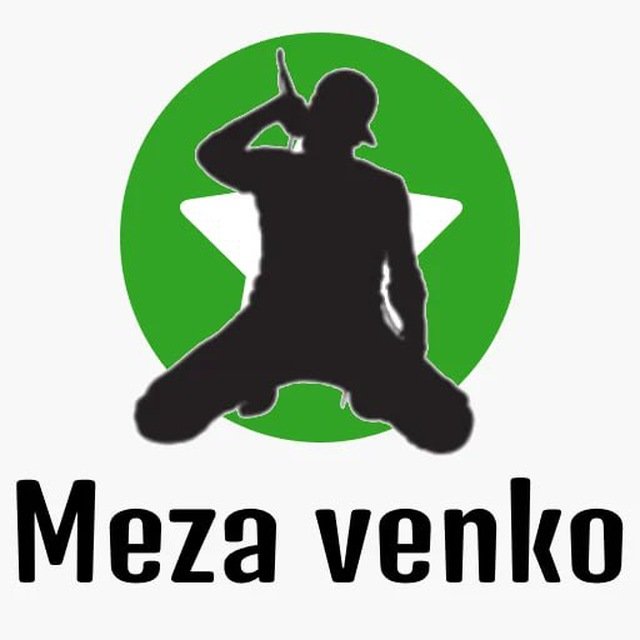

# Mezvenkisto
Telegram bot for calculating duration of all voice messages sent through day, month, year in Nova Esperantujo.



> [!NOTE]
> FRAPULO = Flua Reta Aktiva Parolanto + (UL) + (O) ≈ Fluent Online Active Speaker

> [!NOTE]
> Talpo = Mole (same sense)

## Meza Venko
Meza Venko estas paŝo al Fina Venko popularigita de la hispana esperantisto Paroliĝema Francisko kiel fina celo de la Voĉmesaĝa Revolucio.

Laŭ ties ideo, la Meza Venko atingeblas nur se plejmulto da esperantistoj iĝos "frapuloj".

Por mezvenki ĉiu esperantisto meznombre devas voĉmesaĝi cent minutan parolon por validigi kaj firmigi Esperanton kiel lingvo parolata.

Bonŝance aŭ malbonŝance la nura vojo uzigi Esperanton restas mem uzi ĝin por scivoligi aliajn.

## Intermediate Victory
Intermediate Victory is a step towards Final Victory popularized by the Spanish Esperantist Paroligxema Francisco as the final goal of the Voice Message Revolution.

According to his idea, the Intermediate Victory can only be achieved if the majority of Esperantists becomes "frapuloj" (en. 'hitters').

In order to win, every esperantist on average has to voice message a hundred minute speech to validate and consolidate Esperanto as a spoken language.

Fortunately or unfortunately, the only way to make Esperanto used is to use it yourself to make others curious.

## Fina Venko
https://eo.wikipedia.org/wiki/Fina_Venko

## Final Victory
https://en.wikipedia.org/wiki/Finvenkism

### La ideo de ĉi tiu roboto
Por mezvenki esperantistoj en NE devus paroli kune almenaŭ unu horon ĉiutage.

Se ili parolas pli ol unu horon, oni montros al ili kuraĝigan filmeton.

Se ili parolas pli ol du horojn, oni montros al ili komfortigan filmeton.

Se ili parolas pli ol 27 horojn, oni montros al ili misteran filmeton.

### The idea of this robot
To win esperantists in NE should speak together at least one hour every day.

If they speak more than one hour they will be shown encouraging video.

If they speak more than two hours they will be shown cozy video.

If they speak more than 27 hours they will be shown mistycal video.

> [!NOTE]
> https://www.youtube.com/watch?v=Zt_DIhbYNa4 1+ horo filmeto / 1+ hour video

> [!NOTE]
https://www.youtube.com/watch?v=4ilbLTR5rg8 2+ horoj filmeto / 2+ hours video

> [!NOTE]
https://www.youtube.com/watch?v=sijVvMsNCNo 27+ horoj filmeto / 27+ hours video

## Start Telegram bot and log
```shell
./main 2>&1 | tee /var/tmp/mezvenkisto.tmp 
```
